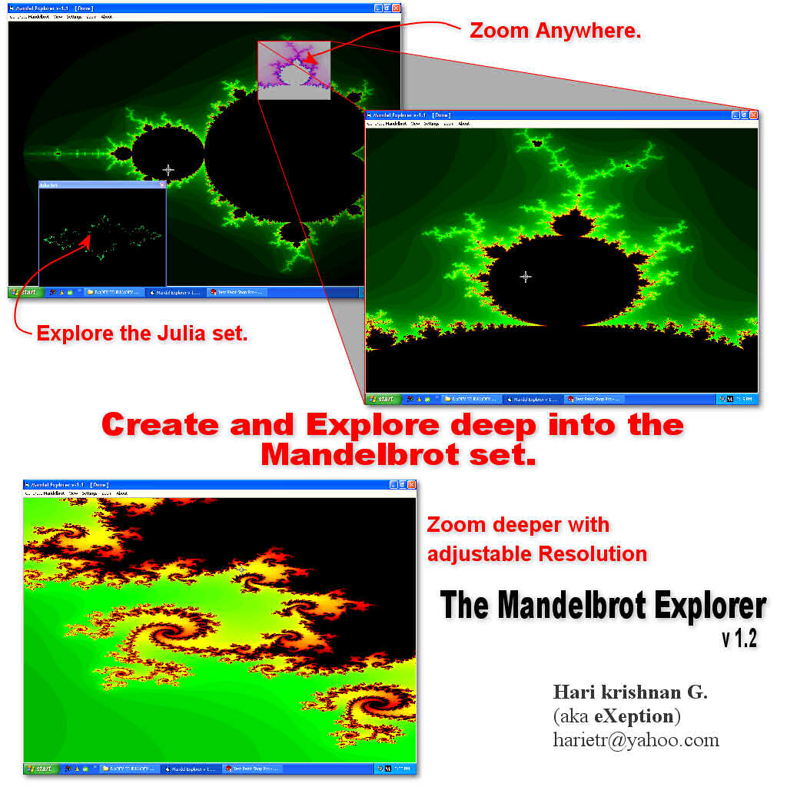



## Mandelbrot Explorer 1\.2 \(\*\*\*\*\*Extreme\*\*\*\*\)  with Deep ZOOM support\!\!\!\!\!   Must See\!

### Description

SEE THE SCREEN-SHOT FIRST!!!!!!!!!!

This program explores mandelbrot into any level you want! it is an update to my earliest submission.

Now the Julia set is expanded withis a floting window which can be closed and reopened using View menu.

NEW : YOU CAN ALSO SET NEW INTERRESTING PALETTES WITH THE PALETTE EDITOR. [ settings -> Change Palette ]

Please don't forget to rate me if you like this...
 
### More Info
 

             |
---                |---
**Submitted On**   |2004-01-13 22:49:04
**By**             |[Hari Krishnan](https://github.com/Planet-Source-Code/PSCIndex/blob/master/ByAuthor/hari-krishnan.md)
**Level**          |Advanced
**User Rating**    |5.0 (25 globes from 5 users)
**Compatibility**  |VB 6\.0
**Category**       |[Graphics](https://github.com/Planet-Source-Code/PSCIndex/blob/master/ByCategory/graphics__1-46.md)
**World**          |[Visual Basic](https://github.com/Planet-Source-Code/PSCIndex/blob/master/ByWorld/visual-basic.md)
**Archive File**   |[Mandelbrot1797379252004\.zip](https://github.com/Planet-Source-Code/hari-krishnan-mandelbrot-explorer-1-2-extreme-with-deep-zoom-support-must-see__1-56342/archive/master.zip)

